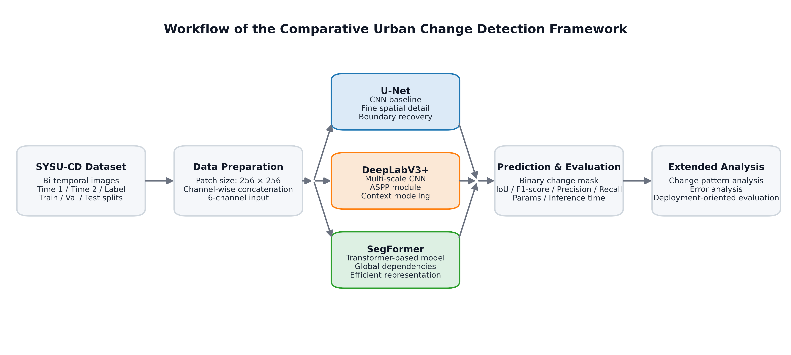

# Urban Change Detection in Hong Kong

## Project Overview

This project studies urban change detection in Hong Kong using the SYSU-CD change detection dataset. Manual interpretation of remote sensing images is slow and difficult to scale, so this project uses deep learning models to automatically identify changed regions from bi-temporal aerial images.

The main goal is to compare three representative deep learning architectures for binary urban change detection:

- **U-Net** as a stable convolutional baseline.
- **DeepLabV3+** as an intermediate model with multi-scale context modeling.
- **SegFormer** as a Transformer-based model for hierarchical feature extraction.

The project compares these models using IoU, F1-score, precision, recall, model size, inference time, visual predictions, and error analysis across different change patterns.

## Workflow



## Repository Structure

```text
DSAN6600-final-project/
  configs/       Model and error-analysis configuration files
  data/          Dataset folders, split files, and subset ID files
  docs/          Team and project documentation
  notebooks/     Data analysis, model training, comparison, and prediction notebooks
  outputs/       Saved metrics, figures, prediction masks, and error-analysis tables
  src/           Reusable data loading and plotting utilities
  tests/         Pytest validation suite
  README.md      Project documentation
  requirements.txt
```

## Data

This project uses the **SYSU Change Detection Dataset**, a high-resolution bi-temporal aerial image dataset for Hong Kong.

- Region: Hong Kong
- Image type: bi-temporal aerial image patches
- Label type: binary change masks
- Spatial resolution: 0.5 m
- Patch size: 256 x 256
- Time range: 2007-2014
- Dataset source: https://github.com/liumency/SYSU-CD

Expected local data structure:

```text
data/
  train/
    time1/
    time2/
    label/
  val/
    time1/
    time2/
    label/
  test/
    time1/
    time2/
    label/
  subsets/
    subset_train_1500.txt
    subset_val_500.txt
    subset_test_500.txt
```

Each sample uses a `time1` image, a `time2` image, and a corresponding binary `label` mask. The project concatenates the two RGB images into a 6-channel input tensor.

## Environment Setup

Create and activate a Python environment:

```bash
python -m venv .venv
source .venv/bin/activate
```

Install dependencies:

```bash
pip install -r requirements.txt
```

Full model training is recommended on a GPU. The notebooks can also be run in Google Colab if the project folder and data are mounted correctly.

## How to Run

Run the notebooks in the following order:

```text
notebooks/00_data_collection_initial_analysis.ipynb
notebooks/01_unet.ipynb
notebooks/02_deeplabv3plus.ipynb
notebooks/03_segformer.ipynb
notebooks/04_comparison.ipynb
notebooks/05_error_analysis.ipynb
notebooks/06_prediction.ipynb
```

The model settings are stored in:

```text
configs/unet.yaml
configs/deeplabv3plus.yaml
configs/segformer.yaml
configs/error_analysis.yaml
```

Example usage of the dataset utility:

```python
from src.data_utils import SYSUCDDataset

dataset = SYSUCDDataset(root_dir="data", split="test")
sample = dataset[0]

print(sample["image"].shape)  # torch.Size([6, H, W])
print(sample["mask"].shape)   # torch.Size([1, H, W])
print(sample["id"])
```

## Testing & Validation

This project includes a lightweight pytest suite in `tests/test_pipeline.py`. The tests validate data-folder alignment, dataset tensor shapes, binary mask loading, configuration consistency, metric file schemas, shared test IDs, and prediction coverage.

Run the tests from the project root:

```bash
python -m pytest -q
```

You can also run the test file directly:

```bash
python tests/test_pipeline.py
```

A successful run should report all tests passing, for example `13 passed`. Passing tests mean the data, configs, preprocessing utilities, and saved output artifacts are internally consistent. These tests do not retrain the models or prove model optimality; they validate that the reported experiments are based on coherent inputs and outputs.

## Results

The main model comparison outputs are saved under:

```text
outputs/unet/
outputs/deeplabv3plus/
outputs/segformer/
outputs/error_analysis/
```

Current saved test metrics:

| Model | IoU | F1 | Precision | Recall | Params (M) | Inference Time (ms) |
|---|---:|---:|---:|---:|---:|---:|
| U-Net | 0.5876 | 0.7402 | 0.7512 | 0.7296 | 31.05 | 0.1387 |
| DeepLabV3+ | 0.6033 | 0.7525 | 0.7432 | 0.7621 | 8.98 | 0.1178 |
| SegFormer | 0.5126 | 0.6778 | 0.7500 | 0.6183 | 3.72 | 0.4042 |

In the saved results, DeepLabV3+ achieves the highest IoU and F1-score, while U-Net remains competitive and SegFormer has the smallest parameter count but lower recall. Additional prediction coverage and morphology-based error analysis are stored in `outputs/error_analysis/`.
